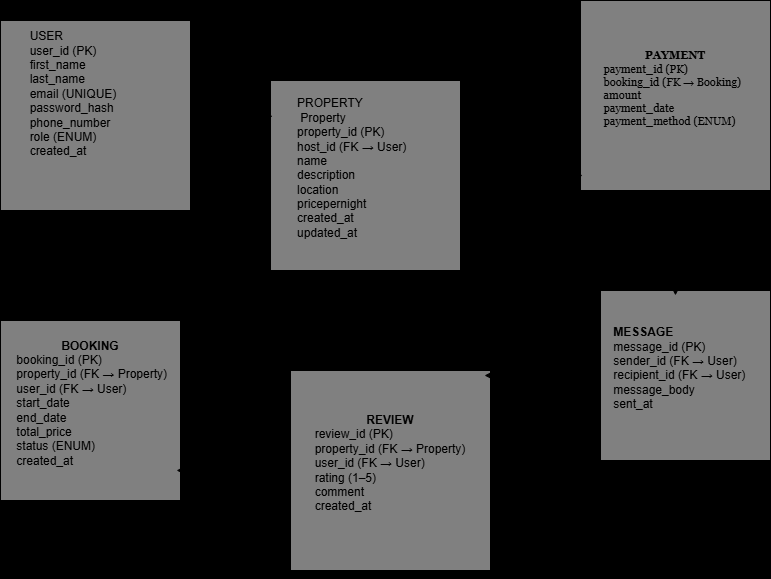

# AirBnB Database Schema (ERD Specification)

## **Entities and Attributes**

### User

| Attribute | Type | Constraints |
|------------|------|-------------|
| **user_id** | UUID | **Primary Key, Indexed** |
| first_name | VARCHAR | NOT NULL |
| last_name | VARCHAR | NOT NULL |
| email | VARCHAR | UNIQUE, NOT NULL |
| password_hash | VARCHAR | NOT NULL |
| phone_number | VARCHAR | NULL |
| role | ENUM (`guest`, `host`, `admin`) | NOT NULL |
| created_at | TIMESTAMP | DEFAULT CURRENT_TIMESTAMP |

---

### Property

| Attribute | Type | Constraints |
|------------|------|-------------|
| **property_id** | UUID | **Primary Key, Indexed** |
| host_id | UUID | **Foreign Key → User(user_id)** |
| name | VARCHAR | NOT NULL |
| description | TEXT | NOT NULL |
| location | VARCHAR | NOT NULL |
| pricepernight | DECIMAL | NOT NULL |
| created_at | TIMESTAMP | DEFAULT CURRENT_TIMESTAMP |
| updated_at | TIMESTAMP | ON UPDATE CURRENT_TIMESTAMP |

---

### Booking

| Attribute | Type | Constraints |
|------------|------|-------------|
| **booking_id** | UUID | **Primary Key, Indexed** |
| property_id | UUID | **Foreign Key → Property(property_id)** |
| user_id | UUID | **Foreign Key → User(user_id)** |
| start_date | DATE | NOT NULL |
| end_date | DATE | NOT NULL |
| total_price | DECIMAL | NOT NULL |
| status | ENUM (`pending`, `confirmed`, `canceled`) | NOT NULL |
| created_at | TIMESTAMP | DEFAULT CURRENT_TIMESTAMP |

---

### Payment

| Attribute | Type | Constraints |
|------------|------|-------------|
| **payment_id** | UUID | **Primary Key, Indexed** |
| booking_id | UUID | **Foreign Key → Booking(booking_id)** |
| amount | DECIMAL | NOT NULL |
| payment_date | TIMESTAMP | DEFAULT CURRENT_TIMESTAMP |
| payment_method | ENUM (`credit_card`, `paypal`, `stripe`) | NOT NULL |

---

### Review

| Attribute | Type | Constraints |
|------------|------|-------------|
| **review_id** | UUID | **Primary Key, Indexed** |
| property_id | UUID | **Foreign Key → Property(property_id)** |
| user_id | UUID | **Foreign Key → User(user_id)** |
| rating | INTEGER | CHECK (`rating` BETWEEN 1 AND 5), NOT NULL |
| comment | TEXT | NOT NULL |
| created_at | TIMESTAMP | DEFAULT CURRENT_TIMESTAMP |

---

### Message

| Attribute | Type | Constraints |
|------------|------|-------------|
| **message_id** | UUID | **Primary Key, Indexed** |
| sender_id | UUID | **Foreign Key → User(user_id)** |
| recipient_id | UUID | **Foreign Key → User(user_id)** |
| message_body | TEXT | NOT NULL |
| sent_at | TIMESTAMP | DEFAULT CURRENT_TIMESTAMP |

---

## **Relationships**

| Relationship | Type | Description |
|---------------|------|-------------|
| **User (host)** - **Property** | 1 : M | One user (host) can own multiple properties. |
| **User (guest)**   -  **Booking** | 1 : M | One user can make many bookings. |
| **Property** - **Booking**  | 1 : M | One property can have many bookings. |
| **Booking** - **Payment** | 1 : 1 | Each booking has one payment. |
| **User** - **Review** | 1 : M | One user can write many reviews. |
| **Property** - **Review** | 1 : M | One property can have many reviews. |
| **User (sender)** - **Message** | 1 : M | One user can send many messages. |
| **User (recipient)** - **Message** | 1 : M | One user can receive many messages. |

---
---

## **Constraints Summary**

- **User Table:**  
  - `user_id` as **Primary Key**  
  - `email` must be **unique**  
  - Non-null: `first_name`, `last_name`, `email`, `password_hash`, `role`  
  - `role` restricted to **(guest, host, admin)**  
  - `created_at` defaults to current timestamp  

- **Property Table:**  
  - `property_id` as **Primary Key**  
  - `host_id` references **User(user_id)**  
  - Non-null: `name`, `description`, `location`, `pricepernight`  
  - `created_at` defaults and `updated_at` auto-updates  

- **Booking Table:**  
  - `booking_id` as **Primary Key**  
  - `property_id` - **Property(property_id)**, `user_id` - **User(user_id)**  
  - Non-null: `start_date`, `end_date`, `total_price`, `status`  
  - `status` limited to **(pending, confirmed, canceled)**  

- **Payment Table:**  
  - `payment_id` as **Primary Key**  
  - `booking_id` - **Booking(booking_id)**  
  - Non-null: `amount`, `payment_method`  
  - `payment_method` limited to **(credit_card, paypal, stripe)**  

- **Review Table:**  
  - `review_id` as **Primary Key**  
  - `property_id` - **Property(property_id)**, `user_id` - **User(user_id)**  
  - Rating must be **1–5**, `comment` required  

- **Message Table:**  
  - `message_id` as **Primary Key**  
  - `sender_id`, `recipient_id` - **User(user_id)**  
  - Non-null: `message_body`, `sent_at` defaults to timestamp  

---

**Referential Integrity:**  
- Cascading deletes maintain consistency across users, properties, bookings, and reviews.  
- Foreign key relationships ensure valid references between all entities.  

---

---

# ERD Sketch (Text-Based Layout)
┌────────────────────────────┐
│          USER              │
├────────────────────────────┤
│ user_id (PK)               │
│ first_name                 │
│ last_name                  │
│ email (UNIQUE)             │
│ password_hash              │
│ phone_number               │
│ role (ENUM)                │
│ created_at                 │
└────────────┬───────────────┘
             │1
             │
             │M
┌────────────▼───────────────┐
│         PROPERTY           │
├────────────────────────────┤
│ property_id (PK)           │
│ host_id (FK → User)        │
│ name                       │
│ description                │
│ location                   │
│ pricepernight              │
│ created_at                 │
│ updated_at                 │
└────────────┬───────────────┘
             │1
             │
             │M
┌────────────▼───────────────┐
│          BOOKING           │
├────────────────────────────┤
│ booking_id (PK)            │
│ property_id (FK → Property)│
│ user_id (FK → User)        │
│ start_date                 │
│ end_date                   │
│ total_price                │
│ status (ENUM)              │
│ created_at                 │
└────────────┬───────────────┘
             │1
             │
             │1
┌────────────▼───────────────┐
│          PAYMENT           │
├────────────────────────────┤
│ payment_id (PK)            │
│ booking_id (FK → Booking)  │
│ amount                     │
│ payment_date               │
│ payment_method (ENUM)      │
└────────────────────────────┘

┌────────────────────────────┐
│          REVIEW            │
├────────────────────────────┤
│ review_id (PK)             │
│ property_id (FK → Property)│
│ user_id (FK → User)        │
│ rating (1–5)               │
│ comment                    │
│ created_at                 │
└────────────────────────────┘

┌────────────────────────────┐
│          MESSAGE           │
├────────────────────────────┤
│ message_id (PK)            │
│ sender_id (FK → User)      │
│ recipient_id (FK → User)   │
│ message_body               │
│ sent_at                    │
└────────────────────────────┘

---
# ERD

  

